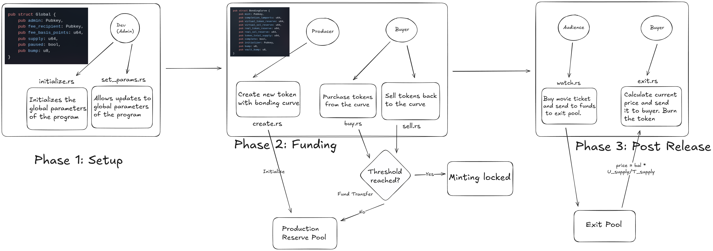
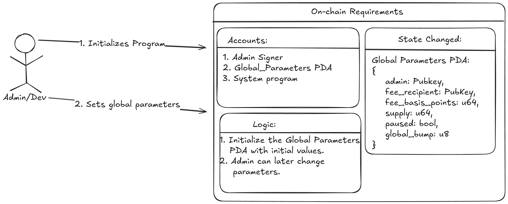
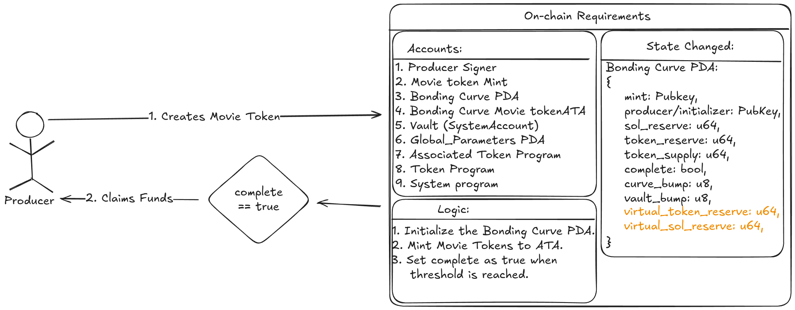
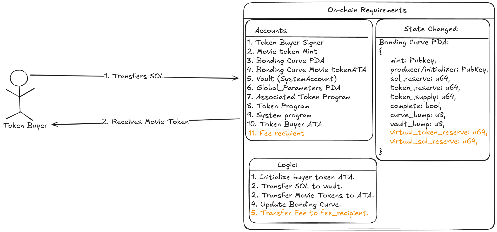
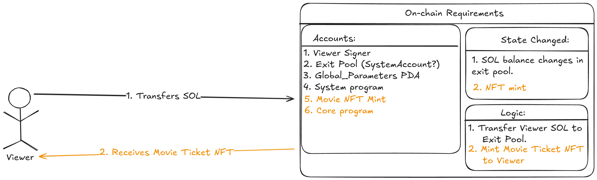
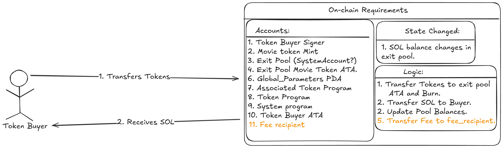

# 🎬 Block-Buster

**Decentralized Movie Crowdfunding & Tokenization Platform on Solana**

Block-Buster revolutionizes how movies are funded, owned, and experienced.  
It allows filmmakers to raise production capital directly from the public through **tokenized crowdfunding campaigns**, where fans and investors can buy **Movie Tokens** tied to real projects.

Each movie becomes its own micro-economy funded, tracked, and traded transparently on-chain.

---

## 🌟 Core Idea

> “What if every movie you love was an asset you could help create?”

Block-Buster gives **fans** the ability to support and gain fractional ownership in film production,  
while **creators** can gauge audience interest and raise funds without traditional intermediaries.

---

## 🚀 Features

### 🎥 For Filmmakers

- **Tokenized Movie Campaigns:** Launch your own movie token and set a funding goal.
- **On-Chain Crowdfunding:** Raise SOL or USDC directly from fans and investors.
- **Predefined Tokenomics:** Set total supply, creator share, and platform fees.
- **Transparent Progress Tracking:** Live funding status visible to everyone.

### 💎 For Fans & Investors

- **Support What You Love:** Buy tokens of upcoming films and become part of their journey.
- **On-Chain Ownership:** Tokens represent verifiable backing in a specific film.
- **Future Liquidity:** Trade tokens post-campaign via integrated bonding curves and DEX liquidity.
- **True Transparency:** All campaign data and transactions live on the Solana blockchain.

---

## ⚙️ Architecture Overview

### End-to-end Overview:



### initialize:



### set_settings:


### create:



### buy:


### release:



### watch:



### sell:



```

Creator (Filmmaker)
↓ creates campaign
↓
[ Movie Token Mint ]  ←─ controlled by BondingCurve PDA
↓
[ BondingCurve Account ] ← stores reserves, funding target, metadata
↓
Fans buy tokens with SOL/USDC
↓
Funds accumulate in on-chain vault
↓
Creator withdraws funds after successful raise

```

### Smart Contract Flow (Anchor)

1. **`create`** — Initializes a movie mint and bonding curve account.
2. **`buy`** — Fans purchase tokens; bonding curve mints and distributes dynamically.
3. **`withdraw`** — Allows the creator to claim funds when campaign goals are met.
4. **`sell`** — Enables token holders to sell back into the bonding curve or trade on DEXs.

---

## 💰 Token Economics

- **Token Standard:** SPL Token (6 decimals)
- **Bonding Curve Model:** Linear for PoC → `P(S) = p₀ + k·S`
- **Initial Price:** Adjustable base (e.g., 0.5 SOL per token)
- **Reserve Asset:** SOL
- **Creator Share:** Configurable percentage during campaign creation
- **Platform Fee:** Optional (e.g., 2–5%) for protocol maintenance and LP seeding

---

## 🧱 Technical Stack

| Layer                 | Tech                                                                       |
| --------------------- | -------------------------------------------------------------------------- |
| **Blockchain**        | [Solana](https://solana.com)                                               |
| **Smart Contracts**   | [Anchor Framework](https://book.anchor-lang.com/)                          |
| **Tokens**            | SPL Token Standard                                                         |
| **Frontend**          | React + TypeScript (planned)                                               |
| **Indexing (future)** | [Yellowstone Vixen](https://github.com/rpcpool/yellowstone-vixen) / Carbon |
| **Testing**           | Mocha + Chai + Anchor Test Suite                                           |

---

## 🧩 Roadmap

| Milestone        | Description                                        | Status         |
| ---------------- | -------------------------------------------------- | -------------- |
| 🎬 PoC           | Deploy core Anchor contracts & test basic flow     | ✅ Done        |
| 💎 Token Trading | Integrate bonding curve buy/sell logic             | 🧠 In progress |
| 🖥 Frontend DApp  | React interface for creators & fans                | 🧱 Planned     |
| 🎟 Ticketing      | On-chain ticket sales using movie tokens           | 🧱 Planned     |
| 💼 Revenue Share | Distribute future film profits via smart contracts | 🧱 Planned     |

---

## 🧑‍💻 Local Development

### Prerequisites

- [Anchor CLI](https://book.anchor-lang.com/chapter_3/installation.html)
- [Solana CLI](https://docs.solana.com/cli/install-solana-cli-tools)
- Node.js v18+

### Build & Test

```bash
anchor build
anchor deploy
anchor test
```

### Key Files

```
programs/
└── blockbuster/
    ├── src/lib.rs              # Anchor program logic
    ├── state.rs                # Account structures (BondingCurve, Settings)
    ├── error.rs                # Custom errors
    └── instructions/
        └── buy.rs              # Users buy movie tokens for SOL
        └── create.rs           # Create movie mint & bonding curve
        └── initialize.rs       # Initialize the global config settings
        └── mod.rs
        └── release.rs          # Creator release movie for viewing
        └── sell.rs             # Users sell movie tokens for SOL
        └── set_settings.rs     # Change the global config settings
        └── watch.rs            # Users pay for movie NFT tickets using SOl
tests/
└── blockbuster.test.ts         # Mocha test suite
```

---

## 🌐 Vision

> _Block-Buster bridges the worlds of art and finance, letting audiences not just watch, but own the stories they believe in._
